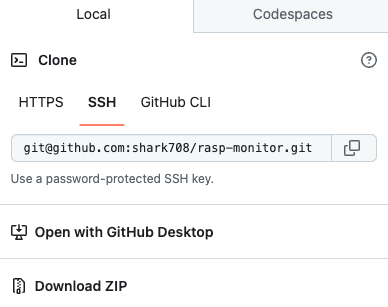

# Rasp-Monitor 树莓派监控器

用于监控树莓派资源，如CPU、内存、进程、GPIO、网络、USB等使用情况。


## 安装

### 直接安装

1. 下载安装包

可以通过git

```
git clone git@github.com:shark708/rasp-monitor.git
```

直接下载




2. 上传文件至树莓派

```
scp -r rasp-monitor xxx@xxx.xxx.xxx.xxx:/xxxx
```

3. 解压后执行命令

```
# 默认启动后是80端口，也可以指定其他端口
./startup.sh 80
```

